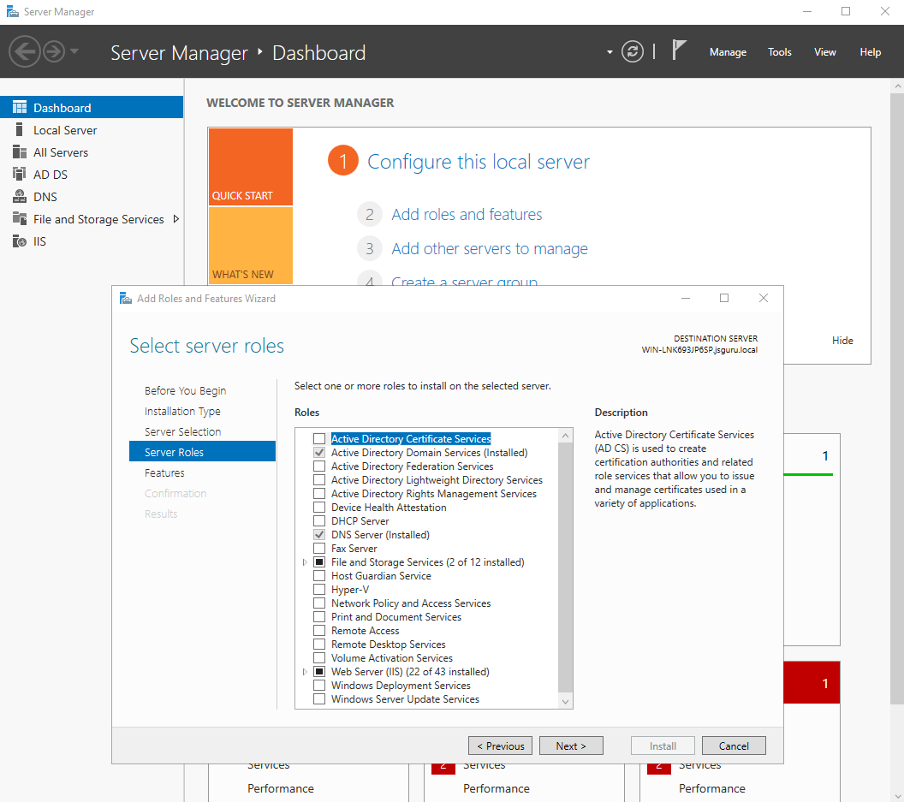
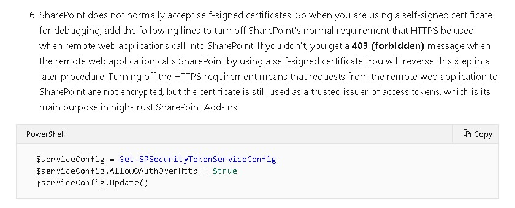
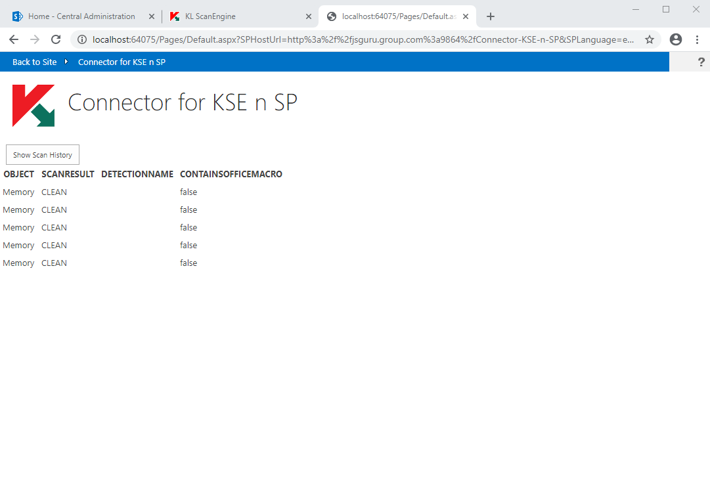

# Guide-SP-Instl-n-AddIn-Env-Config
Guide of SharePoint Server Installation and AddIn Environment Configuration

After Windows Server Installation
- Set up Active Directory in Window Server  
    >Reference Youtube Video [Setting up Active Directory in Windows Server 2019 (Step By Step Guide)](https://www.youtube.com/watch?v=h3sxduUt5a8)  
    
    Install __Active Directory Domain Services__ and __DNS Server__  

      
- Install SharePoint Server
    >Reference Link [Installing SharePoint 2019](https://www.starwindsoftware.com/blog/installing-sharepoint-2019)  

    - Install Microsoft SQL Server
    - Install SharePoint Server
    >After SharePoint Server Installation  
    >ensure that the following services are started
    > - User Profile Service Application
    > - App Management Service
    > - Subscription Settings Service  
    
    Central Administration -> Application Management -> Manage service applications

      

    __First two services__ can be created and started at Central Administration -> Application Management -> Manage service applications
    >Reference Link [How to configure User Profile Service Application in SharePoint 2019](https://support.shortpoint.com/support/solutions/articles/1000286172-how-to-configure-user-profile-service-application-in-sharepoint-2019)  

    __Last one__ should be created and started by commands on SharePoint Management Shell  
    >Reference Links [link1](http://sensoft2000-sharepoint.blogspot.com/2014/10/the-subscription-settings-service-and.html), [Create Subscription Settings Service Application For Add-In Development In SharePoint 2016](https://www.c-sharpcorner.com/article/create-subscription-settings-service-application-for-add-in-development-in-share/)  

    - Syntax  
        ```sh
        > $account = Get-SPManagedAccount [Domain\User]
        > $appPool = New-SPServiceApplicationPool -Name [Application Pool Name] -Account $account
        > $serviceApp = New-SPSubscriptionSettingsServiceApplication -ApplicationPool $appPool -Name [Application Name] -DatabaseName [Database Name]
        > $serviceAppProxy = New-SPSubscriptionSettingsServiceApplicationProxy -ServiceApplication $serviceApp
        ```  

    - Example  
        ```sh
        PS C:\Users\Administrator> $account = Get-SPManagedAccount JSGURU\Administrator
        PS C:\Users\Administrator> $appPool = New-SPServiceApplicationPool -Name SubscriptionServiceAppPool -Account $account
        PS C:\Users\Administrator> $serviceApp = New-SPSubscriptionSettingsServiceApplication -ApplicationPool $appPool -Name "Subscription Settings Service Application" -DatabaseName SubscriptionSettingsDB
        PS C:\Users\Administrator> $serviceAppProxy = New-SPSubscriptionSettingsServiceApplicationProxy -ServiceApplication $serviceApp
        ```  

- SharePoint Server AddIn Environment Configuration  
    (SharePoint Hosted and Provider Hosted)  
    >Reference Link [SharePoint 2016 AddIn Environment Configuration](https://www.sharepoint-journey.com/SharePoint-Server-2016-AddIn-Environment-Configuration.html)  

    If you get a __403 (forbidden)__ message when the remote web application calls SharePoint by using a self-signed certificate, please turn off the HTTPS requirement.
    >Reference Link [Create high-trust SharePoint Add-ins](https://docs.microsoft.com/en-us/sharepoint/dev/sp-add-ins/create-high-trust-sharepoint-add-ins?redirectedfrom=MSDN#code-try-5)

      

    ```sh
    PS C:\Users\Administrator> $serviceConfig = Get-SPSecurityTokenServiceConfig
    PS C:\Users\Administrator> $serviceConfig.AllowOAuthOverHttp = $true
    PS C:\Users\Administrator> $serviceConfig.Update()
    ```

- Why / What Addin? 
    >Reference Link [Develop your first SharePoint Add-In](https://www.sharepoint-journey.com/develop-your-first-sharepoint-add-in.html)

- Give Provider Hosted AddIn the SharePoint look-and-feel
    >Reference Link [Give the remote web application the look and feel of SharePoint](https://docs.microsoft.com/en-us/sharepoint/dev/sp-add-ins/give-your-provider-hosted-add-in-the-sharepoint-look-and-feel#give-the-remote-web-application-the-look-and-feel-of-sharepoint)

    

- Create SharePoint Hosted AddIn In SharePoint Server  
    Prerequisites: [Setting up Active Directory in Windows Server 2019](https://www.youtube.com/watch?v=h3sxduUt5a8)
    >Reference Links  
    >[Setting Up Add-In Development Environment In SharePoint Server 2016](https://www.c-sharpcorner.com/article/setting-up-add-in-development-environment-in-sharepoint-server-2016/)  
    >[Set up an On-Premise development environment for SharePoint Add-in or Apps developement in SharePoint 2016/2013](https://www.enjoysharepoint.com/configure-add-in-or-app-development-environment-in-sharepoint-server-2016/)  
    >[SharePoint Server 2016 AddIn Environment Configuration](https://www.sharepoint-journey.com/SharePoint-Server-2016-AddIn-Environment-Configuration.html)

- Create Event Receiver
    >Reference Link [Creating Simple Event Receiver in SharePoint 2013
](https://www.c-sharpcorner.com/UploadFile/5b1f04/creating-simple-event-receiver-in-sharepoint-2013/)  

- Create Remote Event Receiver on Provider Hosted AddIn
    >Reference Link [Working with Remote Event Receivers in a Provider Hosted App](https://collab365.community/working-with-remote-event-reciver-in-provider-hosted-app/)  

- Custom SharePoint list definition
    >Reference Link [How to create a custom SharePoint list definition using Visual Studio 2012](https://camerondwyer.com/2013/09/20/how-to-create-a-custom-sharepoint-list-definition-using-visual-studio-2012/)

- Create SharePoint farm database on SharePoint Management Shell  
    - Syntax  
        ```sh
        > New-SPConfigurationDatabase –DatabaseName [config db name] –DatabaseServer [sql server name] –AdministrationContentDatabaseName [content db name] –Passphrase (ConvertTo-SecureString [your password] –AsPlaintext –Force) –FarmCredentials (Get-Credential) -localserverrole SingleServerFarm
        ```  
    - Example  
        ```sh
        PS C:\Users\Administrator> New-SPConfigurationDatabase –DatabaseName SharePoint_Config –DatabaseServer WIN-JC2B1V15KM5 –AdministrationContentDatabaseName SharePoint_Content –Passphrase (ConvertTo-SecureString Qwerty@12345 –AsPlaintext –Force) –FarmCredentials (Get-Credential) -localserverrole SingleServerFarm
        ```
- Shell commands
    - Checking solutions installed in the farm
        ```sh
        > Get-SPSolution
        ```
    - Delete solution
        ```sh
        > (Get-SPSolution mysolution.wsp).Delete()
        ```
        Replace __mysolution.wsp__ with your real solution name
    - Disconnect the local server computer from the farm
        ```sh
        > Disconnect-SPConfigurationDatabase
        ```
    - Get the token issuer id
        ```sh
        > Get-SPTrustedSecurityTokenIssuer
        ```